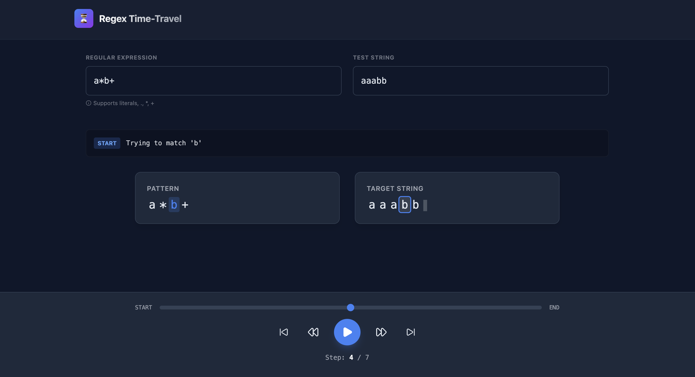

*Every developer uses regex, but few have seen the engine in motion.*

Regular Expressions (Regex) are one of the most powerful tools in a developer's arsenal. We write a pattern, feed it a string, and hope for a match. But what actually happens under the hood?

The secret engine driving most regex implementations relies on **Greediness** and **State Saving** (the foundation of backtracking).

To write efficient patterns, you need to see exactly how the engine consumes characters step-by-step.

## The Experiment: `a*b+`

Let's look at a classic example to see the engine's flow in action.

**Regex:** `a*b+`  
**String:** `aaabb`

The goal is to match zero or more "a"s, followed immediately by one or more "b"s.

### Step 1: The Greedy `a*`
The engine starts with `a*`. The `*` quantifier is **greedy**. It wants to consume as many characters as possible right now.

* It matches the first `a`.
* It matches the second `a`.
* It matches the third `a`.
* It hits the first `b`. Since `b` is not `a`, the `a*` stops matching.

**Current State:** The engine has consumed `aaa`. It records this state so it can come back (backtrack) later if needed, but for now, it feels confident.

*Visualizing Step 1: The engine greedily consumes the first half of the string.*

### Step 2: The Handoff to `b+`
Now the engine advances to the next part of the pattern: `b+`.
The cursor is currently sitting at the first `b` of the string `aaabb`.

* The engine checks if the character `b` satisfies the pattern `b+`.
* **Match!** It consumes the first `b`.

*Visualizing Step 2: The pattern advances to the next token.*

### Step 3: The Greedy `b+` Finish
Just like before, `b+` is greedy. It continues to look for more `b`s.

* It matches the second `b` (the last character of the string).
* It tries to look further, but hits the **End of String**.

Since `b+` requires "one or more" and it has found two, the condition is satisfied.

*Visualizing Step 3: The match is complete.*

### Final Output
The engine has successfully navigated the string from start to finish.

1.  `a*` took `aaa`
2.  `b+` took `bb`

Because the "greedy" path worked on the first try, the engine didn't need to backtrack—but it was ready to!

## Visualizing the Time Travel

Reading about these steps is one thing, but seeing the engine move forward (and backward) in real-time makes the concept click instantly. I built a tool specifically to demonstrate this behavior. 

You can step through regex matches effectively "time traveling" through the engine's decision process.

  <a href="https://durga-kondaveeti.github.io/Regex-Time-Travel-Debugger/" 
     style="background-color: #007BFF; color: white; padding: 15px 32px; text-align: center; text-decoration: none; display: inline-block; font-size: 16px; border-radius: 8px; border: none; cursor: pointer; transition: background-color 0.3s; box-shadow: 0 4px 6px rgba(0,0,0,0.1);">
    🚀 Launch Regex Time-Travel Debugger
  </a>

## Summary

* **Greediness:** The engine grabs as much as it can (`a*` taking `aaa`).
* **The Handoff:** It passes control to the next token (`b+`).
* **Success:** If all tokens are satisfied, the match is valid.

Mastering this flow is the key to debugging complex patterns!